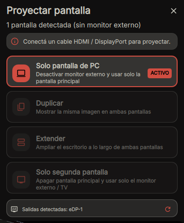
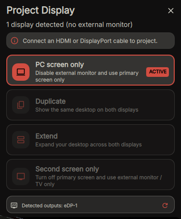

# DMS Projector

Quick display projection and screen mirroring flyout for DankMaterialShell, inspired by Windows Win + P.
| Español | English |
| :---: | :---: |
|  |  |


## Features

- PC Screen Only: Turn off external monitors and use only primary screen.
- Duplicate (Mirror): Clone desktop across both displays.
- Extend: Expand workspaces across screens (right, left, above, below).
- Second Screen Only: Turn off primary screen and output only to external display.
- Auto Shortcut: Automatically registers Super + P keybind on install.
- Bilingual: Full support for English and Spanish.

## Installation

### Via DMS CLI
```bash
dms plugins install dmsProjector
```

### Manual Installation
Clone this repository into your DMS plugins directory:

```bash
git clone https://github.com/osvaldx/dms-projector.git ~/.config/DankMaterialShell/plugins/dmsProjector
```

Then restart DMS:
```bash
dms restart
```

## Shortcut (Win + P)

You can enable the automatic `Super + P` shortcut from the plugin settings, or configure it manually:

- Hyprland: `dms keybinds set hyprland "SUPER + P" "exec dms ipc call widget toggle dmsProjector"`
- Niri: `dms keybinds set niri "Mod+P" "exec dms ipc call widget toggle dmsProjector"`
- Sway: `dms keybinds set sway "Mod4+p" "exec dms ipc call widget toggle dmsProjector"`

## Configuration

Available in DankMaterialShell Settings > Plugins > DMS Projector:

| Setting | Options | Default | Description |
|---|---|---|---|
| Language | English, Español | English | Interface and notification language |
| Extended Direction | Right, Left, Above, Below | Right | Placement of external screen |
| Automatic Shortcut | true / false | false (opt-in) | Auto-register Win + P shortcut |
| Show Notifications | true / false | true | Desktop notification on mode switch |
| Hide when no external | true / false | false | Hide bar icon when no external display is connected |
| Primary Output Override | Text (e.g. eDP-1) | Auto-detect | Manually set primary screen name |
| Secondary Output Override | Text (e.g. HDMI-A-1) | Auto-detect | Manually set external screen name |

## License

MIT License (c) 2026 osvaldx
